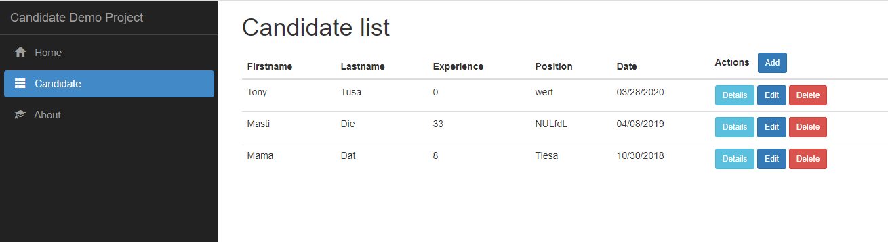

# Candidate Demo Project
It is a demo written on TypeScript and C Sharp over Microsoft Visual Studio 2019 Community Edition. Is very simple project with one used: Angular, ASP.NET Core, SQL Server, etc.

## Description 
It is a simple application that allows entering and viewing candidates in a human resources process. The business requirements for this project are:
* The human resources user must be able to create an account (only email and password) and be able to login.
* The main page has to display a list of the candidates entered
* You must be able to enter a new candidate including name, surname, years of experience, date of application, position applied for and photo or avatar.

## Install steps
- git clone https://github.com/ameksike/cep.onetree.candidate.git
- Update-Database

## Develop steps
### Develop .Net Core Command
- dotnet --version
- dotnet new --install Microsoft.DotNet.Web.Spa.ProjectTemplates::2.2.401
- dotnet new sln 
- dotnet new angular -o webcore.angular.demo.candidate
- dotnet sln add webcore.angular.demo.candidate/webcore.angular.demo.candidate.csproj
- dotnet restore
- dotnet build
- dotnet run 

### Develop Database Command
- Add-Migration "InitialCreate" 
- Update-Database
- Remove-Migration

### Develop Angular Command
- ng generate component about
- ng generate module candidate
- ng generate component candidate/component/list
- ng generate component candidate/component/form
- ng generate component candidate/component/details
- ng generate interface candidate/model/candidate
- ng generate service   candidate/service/uploadimg
- ng generate component candidate/component/avatar

